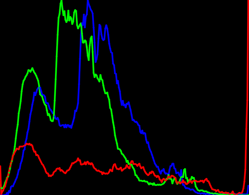
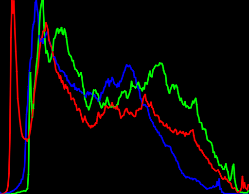
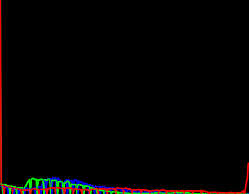
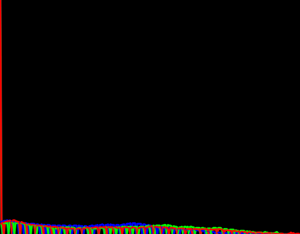

# Введение
В данном проекте была поставлена задача разработать консольное приложение для автоконтрастирования изображений, включающее:
-	Функцию автоконтрастирования по квантилям черного и белого для одноканальных изображений.
-	Функцию автоконтрастирования цветных изображений (поканально и совместно).
-	Автоматическое определение типа входного изображения и применение соответствующего метода автоконтрастирования.

# Основные функции
autoContrastSingleChannel - функция для автоконтрастирования одноканального изображения. В основе лежит вычисление порогов черного и белого по квантилям, что позволяет улучшить контраст изображения.
-	Проверка глубины изображения: Если глубина изображения не 8-битная, оно конвертируется.
-	Расчет гистограммы: Используется функция calcHist для расчета гистограммы яркости изображения.
-	Вычисление порогов: Порог черного вычисляется по альфа-квантилю, а белого — по бета-квантилю.
-	Применение порогов: Изображение нормализуется на основе вычисленных порогов с использованием линейной трансформации.

autoContrastColor - функция для автоконтрастирования цветного изображения. Контраст каждого канала обрабатывается отдельно с использованием функции autoContrastSingleChannel.
-	Разделение на каналы: Используется функция split для разделения изображения на каналы.
-	Автоконтрастирование каждого канала: Каждый канал обрабатывается отдельно.
-	Слияние каналов: Обработанные каналы объединяются обратно в цветное изображение с помощью функции merge.

showHistogram - функция для отображения гистограммы изображения. Создает изображение гистограммы, на котором столбики показывают распределение уровней яркости для каждого цветового канала.
-	Разделение на каналы: Разделяет изображение на каналы.
-	Расчет гистограммы: Вычисляется гистограмма для каждого канала.
-	Нормализация гистограммы: Гистограмма нормализуется для отображения.
-	Отрисовка гистограммы: Гистограммы каналов отображаются на изображении.

# Главная функция main
Функция main выполняет основную логику приложения:
-	Чтение изображения: Используется функция imread для загрузки изображения.
-	Определение типа изображения: Проверяется количество каналов изображения.
-	Применение автоконтраста: В зависимости от количества каналов вызывается соответствующая функция автоконтрастирования.
-	Отображение результатов: Исходное и обработанное изображения отображаются с помощью функции imshow. Также показываются гистограммы изображений.

# Результат:
Параметры: Порог черного 0.15, а белого — 0.0001.

<picture>
  
</picture>
  
Рис. 1 – тестовое изображение 1

<picture>
  
</picture>
  
Рис. 2 – тестовое изображение 2

<picture>
  
</picture>
  
Рис. 3 – результат контрастирования 1 изображения

<picture>
  
</picture>
  
Рис. 4 – результат контрастирования 2 изображения

<picture>
  
</picture>
  
Рис. 5 – результат отрисовки гистограмм тестового изображения 1

<picture>
  
</picture>

Рис. 6 – результат отрисовки гистограмм тестового изображения 2

<picture>
  
</picture>
   
Рис. 7 – результат отрисовки гистограмм контрастированного изображения 1

<picture>
  
</picture>
   
Рис. 8 – результат отрисовки гистограмм контрастированного изображения 2

# Анализ гистограмм
Гистограммы изображений показывают распределение яркости пикселей. Каждая гистограмма имеет:
-	Ось X: Уровни яркости от 0 до 255.
-	Ось Y: Количество пикселей на каждом уровне яркости.
-	Столбики: Высота каждого столбика пропорциональна числу пикселей с соответствующим уровнем яркости.
Гистограммы исходных изображений показывают реальное распределение яркости без изменений. Могут присутствовать пики или провалы, указывающие на недостаток или избыток контраста.
Гистограммы обработанных изображений показывают улучшенное распределение яркости. Пики распределены более равномерно, что указывает на улучшенный контраст.

# Заключение
Созданное приложение эффективно улучшает контраст изображений, автоматически определяя тип изображения (одноканальное или цветное) и применяя соответствующие методы автоконтрастирования. Гистограммы наглядно демонстрируют улучшение распределения яркости после обработки. Этот инструмент может быть полезен для различных задач компьютерного зрения и обработки изображений, где важен улучшенный контраст и качество визуализации.
