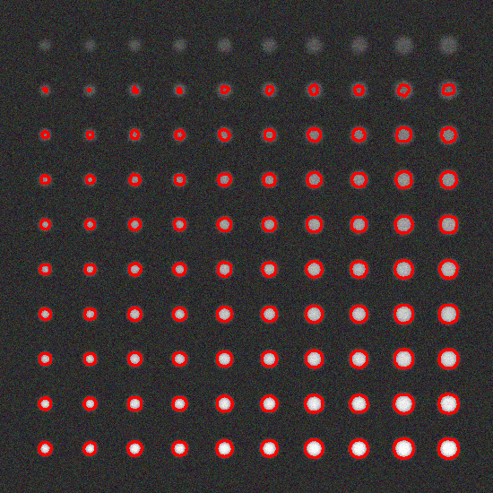
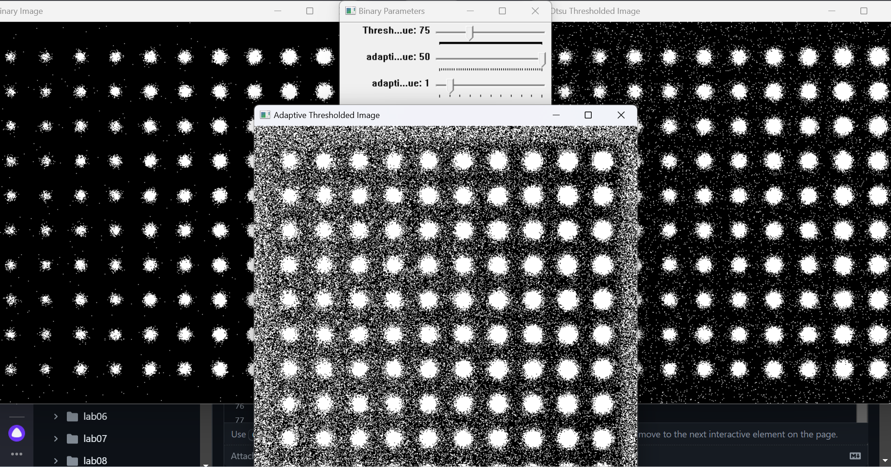

# Введение
Целью проекта было создание консольного приложения для генерации тестовых изображений, бинаризации и детектирования объектов, а также оценки качества детектирования. Основные задачи включали:

1.	Разработку функции для генерации тестовых изображений.
2.	Написание нескольких вариантов функций для бинаризации изображений.
3.	Реализацию режима визуальной настройки параметров бинаризации.
4.	Написание функционала для детектирования объектов.
5.	Реализацию функционала для оценки качества детектирования.
   
# Основные этапы
Функция generateTestImage генерирует тестовое изображение с заданным количеством объектов, диапазоном размеров, значений контраста и степени размытости:
-	Создается черное изображение размером 550x550 пикселей
-	Добавляются круги с различными размерами и контрастом на заданном расстоянии на изображении
-	Применяется гауссово размытие к изображению для добавления шума.

tuneBinaryParameters - функция для визуальной настройки параметров бинаризации:
-	Создание окон с движками (createTrackbar)
-	Обновление бинаризованных изображений - в цикле обновляются изображения при изменении параметров.

Детектирование:
- преобразование в оттенки серого
- бинаризация
- морфологические операции
- контурный анализ.

Оценка качества детектирования – используется функция для оценки качества детектирования на основе метрики IoU:
-	Заполнение истинных и детектированных объектов: Используется fillGroundTruthAndDetected.
-	Вычисление IoU: Используется функция calculateIoU.
-	Оценка TP, FP, FN: Сравниваются детектированные и истинные объекты с заданным порогом IoU.

# Методы бинаризации
Разработаны три метода бинаризации:
-	Пороговая бинаризация (thresholdBinary) - бинаризация с фиксированным порогом
-	Адаптивная бинаризация (adaptiveBinary) - использует метод адаптивного порога
-	Бинаризация методом Отсу (otsuBinary) - автоматический порог, определяемый методом Отсу.

Реализация:
-	Конвертация в градации серого с использованием cvtColor
-	Применение порога в зависимости от метода threshold или adaptiveThreshold.

# Результаты

<picture>
  
</picture>

Рис. 1 – Тестовое изображение 1 c параметрами: 
generateTestImage(100, cv::Range(3, 7), cv::Range(25, 5), 35)
и бинаризацией - threshold(image, image, 20, 100, cv::THRESH_BINARY);

<picture>
  
</picture>

Рис. 2 – Детектированное изображение 1

<picture>
  
</picture>

Рис. 3 – Тестовое изображение 2 c параметрами: 
generateTestImage(100, cv::Range(3, 7), cv::Range(25, 5), 15)

<picture>
  
</picture>

 
Рис. 4 – Детектированное изображение 1

<picture>
  
</picture>

Рис. 5 – Визуальная настройка параметров бинаризации - пороговая, адаптивная и бинаризация методом Отцу

# Таблица по оценке качества

|Number of image|True Positives|False Positives|False Negatives|Average IoU|
|-|-|--------|---|-|
|1|77|13|23|0.68|
|2|87|13|13|0.77|

# Заключение
Созданное приложение эффективно выполняет бинаризацию и детектирование объектов на изображениях с различными условиями освещенности и размытости. Визуальная настройка параметров позволяет точно подстроить алгоритмы под конкретное изображение. Оценка качества детектирования по метрике IoU обеспечивает объективное измерение точности алгоритма.

