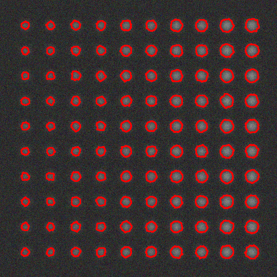

# Введение
Целью проекта было создание консольного приложения для генерации тестовых изображений, бинаризации и детектирования объектов, а также оценки качества детектирования. Основные задачи включали:

1.	Разработку функции для генерации тестовых изображений.
2.	Написание нескольких вариантов функций для бинаризации изображений.
3.	Реализацию режима визуальной настройки параметров бинаризации.
4.	Написание функционала для детектирования объектов.
5.	Реализацию функционала для оценки качества детектирования.
   
# Основные этапы
## Генерация тестового изображения

generateTestImage: Эта функция генерирует тестовое изображение с заданным количеством объектов, диапазоном размеров, значений контраста и степени размытости.

- Создание изображения: Изначально создается черное изображение размером 550x550 пикселей.
- Добавление кругов: Круги с различными размерами и контрастом добавляются на заданном расстоянии на изображении.
- Параметры кругов определяются шагом контраста (contrastStep) и шагом размера (sizeStep).
- Круги добавляются в определенные координаты, и их контраст настраивается с помощью функции convertTo.
- Истинные значения кругов сохраняются в векторе groundTruth для последующей оценки детектирования.
- Размытие изображения: Применяется гауссово размытие для добавления шума к изображению.
- Размытие осуществляется с использованием функции cv::GaussianBlur.
- Добавление шума: Для более реалистичного тестирования создается клон изображения с шумом, добавленным с помощью функции RNG.
## Визуальная настройка параметров бинаризации

tuneBinaryParameters: Эта функция позволяет визуально настроить параметры бинаризации, используя движки (trackbars).

- Создание окон с движками: Окна и движки создаются с помощью функций cvNamedWindow и cvCreateTrackbar.
- Обновление бинаризованных изображений: В цикле обновляются бинаризованные изображения при изменении параметров.
- Используются функции thresholdBinary и adaptiveBinary для бинаризации изображения с заданными параметрами.
- Изображения показываются в окнах с использованием cv::imshow.

## Детектирование

- Преобразование в оттенки серого: Исходное изображение преобразуется в градации серого с использованием cv::cvtColor.
- Бинаризация: Применяются различные методы бинаризации, такие как thresholdBinary, adaptiveBinary, и otsuBinary.
- Морфологические операции: Применяются морфологические операции для улучшения контуров.
- Морфологическое закрытие осуществляется с помощью функции cv::morphologyEx с элементом структуры getStructuringElement.
- Контурный анализ: Найденные контуры анализируются для выделения объектов.
- Контуры находятся с использованием функции cv::findContours.
- Минимальные окружности описываются вокруг контуров для определения объектов.
## Оценка качества детектирования

Для оценки качества детектирования используется метрика IoU (Intersection over Union).

Заполнение истинных и детектированных объектов: Используется функция fillGroundTruthAndDetected для заполнения векторов объектов.
- Вычисление IoU: Функция calculateIoU вычисляет пересечение и объединение двух прямоугольников для определения IoU.
- Оценка TP, FP, FN: Сравниваются детектированные и истинные объекты с заданным порогом IoU для определения количества истинных положительных (TP), ложных положительных (FP) и ложных отрицательных (FN).
- Для каждого истинного объекта проверяется, есть ли совпадение с детектированным объектом с IoU выше порога. Если совпадение найдено, увеличивается счетчик TP, если нет – FN.
- Ложные положительные объекты определяются как детектированные объекты, не совпадающие с истинными.

## Итоговая оценка

В конце программа выводит результаты оценки качества детектирования:

- True Positives (TP): Количество верно детектированных объектов.
- False Positives (FP): Количество ложных срабатываний детектирования.
- False Negatives (FN): Количество пропущенных объектов.
- Среднее значение IoU: Рассчитывается как отношение TP к сумме TP, FN и FP, что дает общее представление о точности детектирования.

# Методы бинаризации
Разработаны три метода бинаризации:
-	Пороговая бинаризация (thresholdBinary) - бинаризация с фиксированным порогом
-	Адаптивная бинаризация (adaptiveBinary) - использует метод адаптивного порога
-	Бинаризация методом Отсу (otsuBinary) - автоматический порог, определяемый методом Отсу.

Реализация:
-	Конвертация в градации серого с использованием cvtColor
-	Применение порога в зависимости от метода threshold или adaptiveThreshold.

# Результаты

<picture>
  
</picture>

Рис. 1 – Тестовое изображение 1 c параметрами: 
generateTestImage(100, cv::Range(3, 7), cv::Range(25, 5), 35)
и бинаризацией - threshold(image, image, 20, 100, cv::THRESH_BINARY);

<picture>
  
</picture>

Рис. 2 – Детектированное изображение 1

<picture>
  
</picture>

Рис. 3 – Тестовое изображение 2 c параметрами: 
generateTestImage(100, cv::Range(3, 7), cv::Range(25, 5), 15)

<picture>
  
</picture>

 
Рис. 4 – Детектированное изображение 1

<picture>
  
</picture>

Рис. 5 – Визуальная настройка параметров бинаризации - пороговая, адаптивная и бинаризация методом Отцу

# Таблица по оценке качества

|Number of image|True Positives|False Positives|False Negatives|Average IoU|
|-|-|--------|---|-|
|1|77|13|23|0.68|
|2|87|13|13|0.77|

# Заключение
Созданное приложение эффективно выполняет бинаризацию и детектирование объектов на изображениях с различными условиями освещенности и размытости. Визуальная настройка параметров позволяет точно подстроить алгоритмы под конкретное изображение. Оценка качества детектирования по метрике IoU обеспечивает объективное измерение точности алгоритма.

