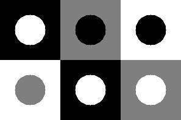
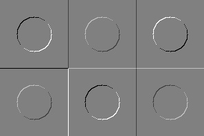
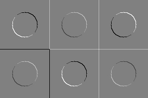
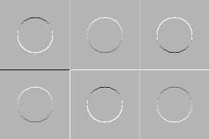
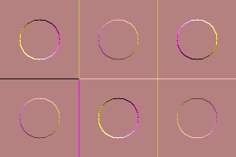

# Введение
Целью данного проекта является создание консольного приложения, которое генерирует тестовые изображения, применяет к ним линейные фильтры и визуализирует результаты. В отчете описаны следующие шаги:
1.	Генерация изображений круга на фоне квадрата с различными уровнями серого.
2.	Применение линейных фильтров с заданными ядрами.

Ядро для L1:
```
   +1  0 
   0  -1 
```
Ядро для L2:
```
   -1  0 
   0  +1 
```
3.	Объединение результатов фильтрации и визуализация.

# Описание решения
На изображении "Test Images" представлены все комбинации круга и квадрата с различными уровнями серого. Эти изображения служат исходными данными для последующей фильтрации.
Функция filter2D нужна для применения линейных фильтров с заданными ядрами. Она используется для создания "I1 Images" и "I2 Images", которые представляют собой результаты фильтрации исходных изображений с использованием двух различных ядер. Эти изображения показывают горизонтальные и вертикальные градиенты.
Изображение "I3 Images", которое является результатом комбинирования изображений I1 и I2 с использованием операции вычисления модуля вектора (sqrt(I1I1 + I2I2)) - magnitude. Оно представляет общую интенсивность градиента в каждом пикселе.
На изображении "Visualized Image" представлены результаты фильтрации в цвете, где каждый канал RGB соответствует одному из изображений I1, I2 и I3. Это позволяет визуально оценить распределение градиентов и их интенсивности.

# Результат:

 <picture>
  
</picture>

Рис. 1 – Тестовое изображение

<picture>
  
</picture>
 
Рис. 2 – l1 изображение

<picture>
  
</picture>

Рис. 3 – l2 изображение

<picture>
  
</picture>
 
Рис. 4 – l3 изображение

<picture>
  
</picture>
 
Рис. 5 – итоговое изображение


# Заключение
Данное приложение успешно генерирует тестовые изображения и применяет к ним линейные фильтры с заданными ядрами. Визуализация результатов в RGB формате позволяет наглядно представить распределение и интенсивность градиентов. Этот инструмент может быть полезен для анализа изображений и предварительной обработки данных перед дальнейшим анализом.

