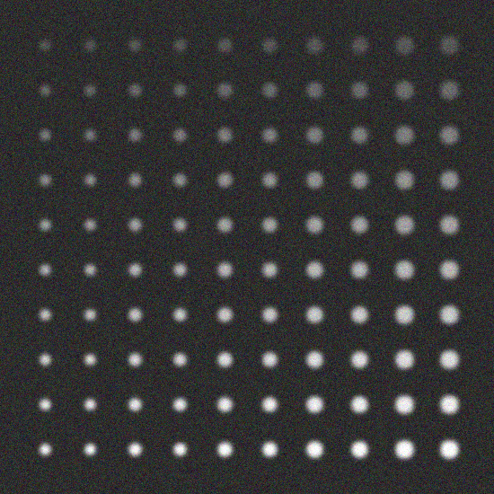
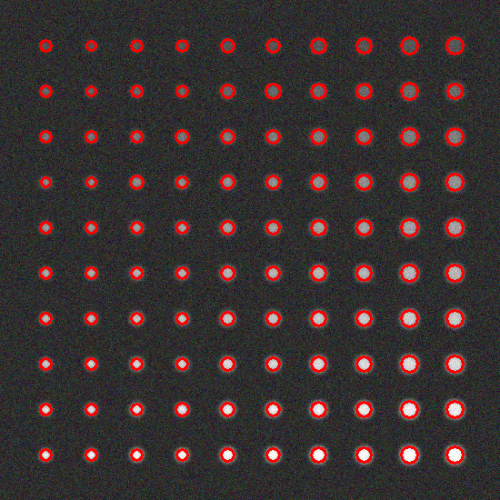
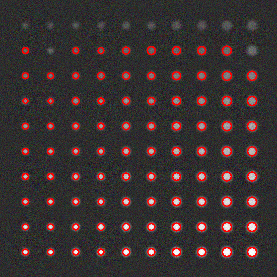

# Введение
Данный проект реализует детектор объектов с использованием преобразования Хафа для детекции окружностей на изображении. Также проводится анализ результатов методом FROC (Free Response Operating Characteristic). В отчете описаны использованные функции, типы данных и алгоритмы для выполнения задачи. Результаты сравниваются с предыдущими методами бинаризации и простого детектирования объектов.

# Основные функции
Для детекции окружностей используется функция HoughCircles, которая применяет метод Преобразования Хафа.
Функция detectCirclesHough выполняет следующие шаги:
1.	Преобразует входное изображение в оттенки серого (cvtColor).
2.	Применяет гауссово размытие для уменьшения шумов (GaussianBlur).
3.	Применяет Преобразование Хафа для детекции окружностей (HoughCircles).
4.	Заполняет вектор detectedCircles найденными окружностями.
   
Функция drawCircles рисует обнаруженные окружности на изображении для визуализации.
Для оценки точности детекции используется функция calculateIoU, которая вычисляет коэффициент IoU между двумя окружностями.
Функция computeFROC проводит анализ FROC для оценки результатов детекции.
- True Positives (TP): число правильно детектированных окружностей.
- False Positives (FP): число ложноположительных детекций.
- False Negatives (FN): число пропущенных окружностей.
- Sensitivity: чувствительность, которая рассчитывается как TP / (TP + FN).
- Avg FP per Image: среднее число ложноположительных детекций на изображение.

# Сравнение с методами из 4 лр
-	Высокая точность детекции окружностей 
-	Возможность настройки параметров преобразования Хафа для улучшения результатов.
-	Более высокая вычислительная сложность по сравнению с методами бинаризации из 4 лр
-	Зависимость от качества входного изображения и уровня шума.

# Результат:

<picture>
  
</picture>
   
Рис. 1 – тестовое изображение

<picture>
  
</picture>
   
Рис. 2 – Детектированные изображения с HoughCircles(gray, circles, cv::HOUGH_GRADIENT, 1, gray.rows / 16, 30, 10, 5, 10);
   
<picture>
  
</picture>
   
Рис. 3 – Детектированные изображения с HoughCircles(gray, circles, cv::HOUGH_GRADIENT, 1, gray.rows / 16, 80, 10, 5, 10);

# Оценке качества

|Number of detection|True Positives|False Positives|False Negatives|Sensitivity|Average IoU|
|-|-|--------|---|-|-|
|1|100|0|0|1|0|
|2|88|0|12|1|0|

# Заключение
Детектор окружностей с использованием преобразования Хафа и анализ FROC показали хорошие результаты в задачах детекции объектов. По сравнению с методами бинаризации и простого детектирования, преобразование Хафа более точно определяет окружности, что подтверждается высокими показателями чувствительности и низким числом ложноположительных детекций.
