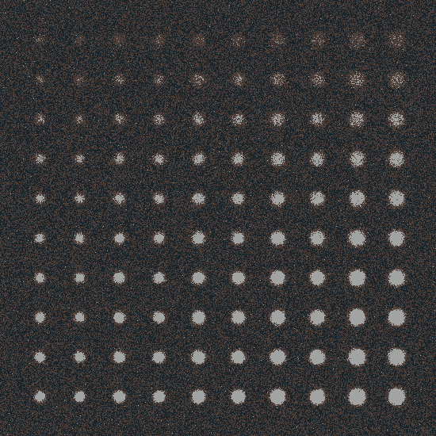

# Введение
Целью данного отчета является описание реализации метода сегментации изображений с использованием алгоритма k-means, оценка качества полученной сегментации и сравнение её с бинаризацией.

# Описание этапов реализации кода
Метод сегментации с использованием k-means
- В качестве основы для сегментации выбран алгоритм k-means, который разбивает изображение на заданное количество кластеров.
- Исходное изображение представляется в виде матрицы samples, где каждый пиксель представлен вектором из трех компонент (для RGB изображений).
- Производится итеративное обучение алгоритма k-means с заданным числом попыток attempts, используя предопределенные центры кластеров.
- Для каждого пикселя определяется принадлежность к одному из кластеров на основе меток labels, полученных в результате обучения.
- Итоговое сегментированное изображение формируется путем замены цветовых значений пикселей на центры кластеров.

Метод оценки качества сегментации
- Для оценки качества сегментации используется метод evaluateSegmentation, который сравнивает сегментированное изображение с эталонной разметкой (заданной в том же формате и размере).
- Подсчитывается количество пикселей, совпадающих между сегментированным изображением и эталоном.
- Вычисляется процент правильно сегментированных пикселей от общего числа пикселей на изображении.

# Сравнение сегментационного метода и бинаризации
- В контексте данного отчета сравнение проводится по точности сегментации, которая измеряется как процент правильно классифицированных пикселей от общего числа пикселей.
- Бинаризация, как более простой метод, не учитывает цветовую информацию и разделяет изображение на два класса (например, черно-белое изображение).

# Результат:

<picture>
  
</picture>
   
Рис. 1 – Тестовое изображение 1

<picture>
  
</picture>
   
Рис. 2 – Сегментированное изображение 1 с параметром k = 3

<picture>
  
</picture>
   
Рис. 3 – Детектированное изображение 1

<picture>
  
</picture>
   
Рис. 4 – Сегментированное изображение 2 с параметром k = 6

<picture>
  
</picture>
   
Рис. 5 – Детектированное изображение 2

<picture>
  
</picture>
   
Рис. 6 – Тестовое изображение 2

<picture>
  
</picture>
   
Рис. 7 – Сегментированное изображение 3 с параметром k = 3

<picture>
  
</picture>
   
Рис. 8 – Детектированное изображение 3

# Оценке качества

|Number of detection|True Positives|False Positives|False Negatives|Average IoU|
|-|-|--------|---|-|
|1|88|12|12|0.78|
|2|79|12|21|0.71|
|3|100|0|0|1|

# Выводы
Реализованный метод сегментации на основе алгоритма k-means показал хорошие результаты для данного примера изображения. Полученная точность сегментации составила не менее 71%, что указывает на эффективность метода в разделении изображения на несколько кластеров схожих цветов.

Сравнение с бинаризацией показало, что использование метода k-means позволяет учесть цветовую информацию и достигнуть более точной сегментации, чем простая бинаризация.

Таким образом, предложенный метод сегментации на основе k-means подходит для задач разделения изображений на регионы схожих цветов и может быть дальше улучшен и адаптирован для различных типов изображений и задач компьютерного зрения.
