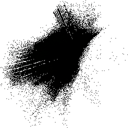
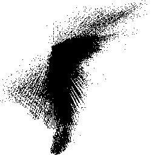
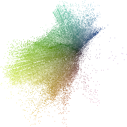
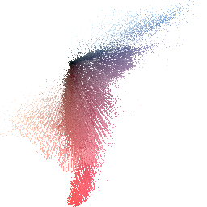

# Введение
Целью данного задания является визуализация плотности цветового распределения изображения в линейном цветовом пространстве RGB (linRGB). Данный процесс включает преобразование входного изображения в linRGB, проекцию цветовых точек на двумерную плоскость, построение гистограммы плотности и отображение результатов. В этом отчете представлены этапы реализации кода и полученные результаты.

# Описание этапов реализации кода
1. Первым шагом является загрузка входного изображения. Для этого используется функция imread из библиотеки OpenCV, которая считывает изображение в формате BGR.
2. Преобразование в linRGB. Для более точного анализа цветового распределения изображение преобразуется в линейное цветовое пространство RGB. Это преобразование проводится с помощью функции convertToLinearRGB. В этой функции:
- Изображение конвертируется в формат CV_64FC3 для точных вычислений.
- Значения пикселей нормализуются в диапазоне от 0 до 1.
- К каждому цветовому каналу применяется линейное преобразование, которое компенсирует гамма-коррекцию.
3. Проекция цветовых точек. Цветовые точки из линейного пространства RGB проецируются на двумерную плоскость. Проекция выполняется с использованием двух векторов нового базиса. Вектор от центра координат к текущей точке проецируется на базисные векторы с помощью функции projectToPoint.
4. Построение гистограммы плотности. Для визуализации плотности цветового распределения используется двумерная гистограмма. Функция createProjectionHistogram создает изображение гистограммы, где каждая точка окрашивается в цвет, соответствующий исходному цвету пикселя изображения.
- Сначала определяется диапазон значений для нормализации координат проекций.
- Затем каждая проекция нормализуется и заполняет соответствующую ячейку гистограммы.
5. Отображение результатов. Полученные гистограммы проекций отображаются с использованием функций OpenCV imshow и imwrite:
- Гистограмма проекций в линейном цветовом пространстве отображается и сохраняется.
- Гистограмма проекций в исходном цветовом пространстве также отображается и сохраняется для сравнения.
6. Запись данных в файл. Для анализа результатов проекции, данные координат проекций и соответствующих цветов записываются в текстовый файл.

# Результат:

<picture>
  
</picture>
   
Рис. 1 – тестовое изображение 1

<picture>
  
</picture>
   
Рис. 2 – тестовое изображение 2

<picture>
  
</picture>
   
Рис. 3 – Гистограмма проекций в линейном цветовом пространстве изображения 1

<picture>
  
</picture>
   
Рис. 4 – Гистограмма проекций в линейном цветовом пространстве изображения 2

<picture>
  
</picture>
   
Рис. 5 – Гистограмма проекций в исходном цветовом пространстве изображения 1

<picture>
  
</picture>
   
Рис. 6 – Гистограмма проекций в исходном цветовом пространстве изображения 2

# Вывод
В результате выполнения задания была реализована и протестирована программа для визуализации плотности цветового распределения в linRGB. Основные этапы включали загрузку изображения, преобразование в линейное цветовое пространство, проекцию цветовых точек, построение и отображение гистограммы плотности. Данный подход позволяет более точно анализировать цветовое распределение и выявлять особенности изображения, которые могут быть незаметны в стандартном цветовом пространстве RGB. Полученные гистограммы предоставляют визуальное представление о плотности цветов и могут быть использованы для дальнейшего анализа и обработки изображений.
