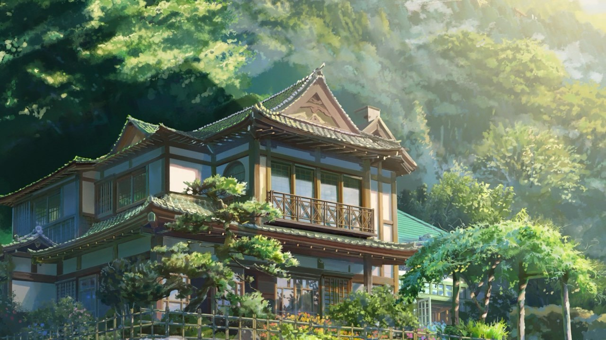
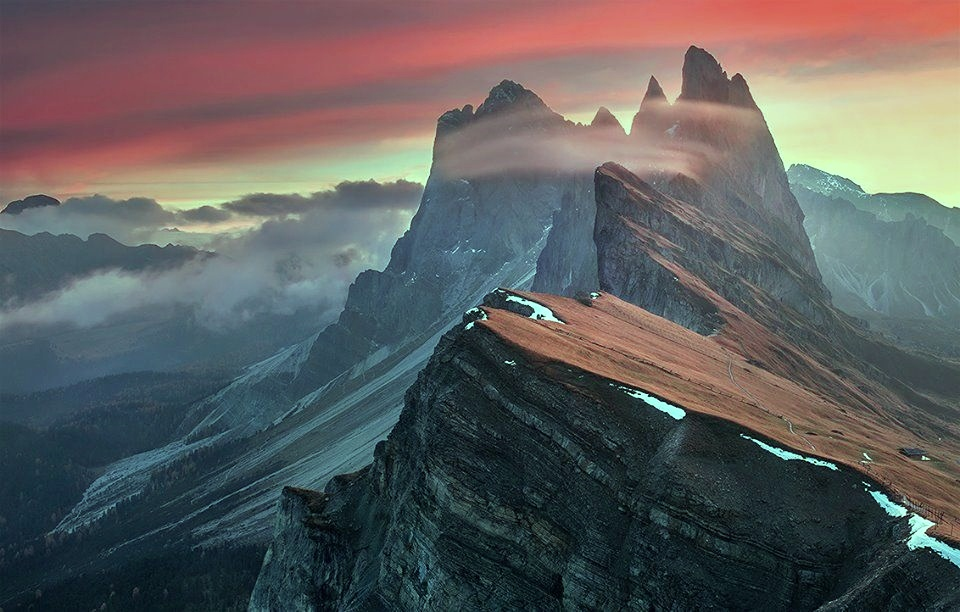

# Введение
Цель данного задания заключается в реализации алгоритма "Gray World" для автоматической балансировки белого цвета на изображении. Алгоритм основан на предположении, что средние значения интенсивностей каналов RGB должны быть равны, что соответствует нейтрально-серому цвету. Этот метод корректирует цвета изображения так, чтобы его общий тон стал более нейтральным и естественным.

# Основные этапы
1. Входное изображение загружается с использованием функции imread.
2. После успешной загрузки изображения вычисляются средние значения для каждого цветового канала (R, G, B) с помощью функции mean. Это позволяет определить, насколько каждый канал отклоняется от среднего значения, которое должно быть достигнуто для получения нейтрального серого цвета.
3. На основе вычисленных средних значений для каждого канала рассчитываются коэффициенты коррекции. Среднее значение всех каналов (avgGray) используется для вычисления коэффициентов для каждого канала:
- kB для синего канала,
- kG для зеленого канала,
- kR для красного канала.
Эти коэффициенты позволяют масштабировать значения каждого канала так, чтобы их средние значения стали равными.
4. Затем осуществляется коррекция значений пикселей каждого канала изображения. Для этого каждый пиксель умножается на соответствующий коэффициент коррекции. Для приведения результатов в допустимый диапазон значений (0-255) используется функция saturate_cast.
5. После применения алгоритма откорректированное изображение отображается с использованием функций imshow. Оригинальное и сбалансированное изображения показываются в отдельных окнах для визуального сравнения. Также результат сохраняется на диск с помощью функции imwrite.

# Результат

<picture>
  
</picture>
   
Рис. 1 – тестовое изображение 1

<picture>
  
</picture>
   
Рис. 2 – тестовое изображение 2

<picture>
  
</picture>
   
Рис. 3 – откорректированное изображение 1

<picture>
  
</picture>
   
Рис. 4 – откорректированное изображение 2

# Вывод
В результате выполнения задания был реализован и протестирован алгоритм "Gray World" для автоматической балансировки белого цвета на изображении. Применение данного алгоритма позволяет улучшить цветовой баланс изображения, сделав его более естественным и нейтральным по тону. Это особенно полезно в условиях, где освещение неравномерно и требует коррекции для более точной цветопередачи.

